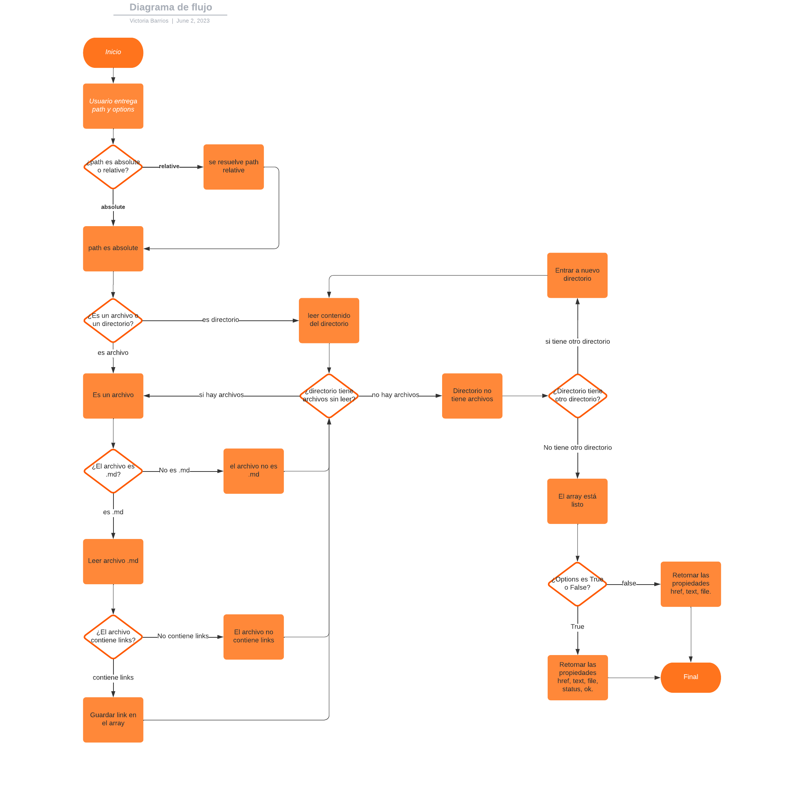
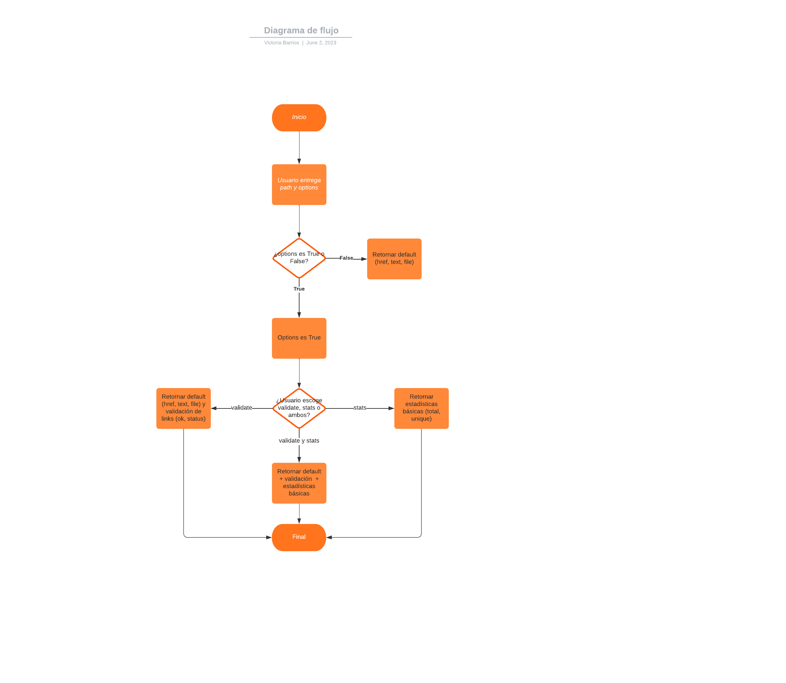

# Markdown Links

## Índice

* [1. Instalación](#1-instalación)
* [2. Modo de uso](#2-modo-de-uso)
* [3. Ejemplos de uso](#3-ejemplos-de-uso)
* [4. Diagrama de flujo](#4-diagrama-de-flujo)


## 1. Instalación

Para instalar:

```sh
npm i mdlinks-reloaded
```

## 2. Modo de uso

En la terminal escribe:

```sh
mdlinks <ruta_de_archivo_o_directorio> [--validate] [--stats]
```

 * mdlinks: palabra clave para iniciar el funcionamiento
 * <ruta_de_archivo_o_directorio>: ruta donde se encuentran los links de los archivos .md
 * --validate: opción que entrega información sobre el estado de los links encontrados.
 * --stats: opción que entrega estadísticas básicas de los links.
 * --validate --stats: opción combinada que entrega estadísticas básicas y sobre la validación de los links.


## 3. Ejemplos de uso

Si deseas solo extraer los links de tu ruta con información básica:

```sh
mdlinks README.md
```

Si deseas extraer los links de tu ruta con información básica y además con información de su estado:

```sh
mdlinks README.md --validate
```

Si deseas obtener estadistica básica sobre los links de tu ruta:

```sh
mdlinks README.md --stats
```

Si deseas obtener estadistica básica sobre los links de tu ruta y además sobre la validación de los links:

```sh
mdlinks README.md --validate --stats
```

## 4. Diagrama de flujo



